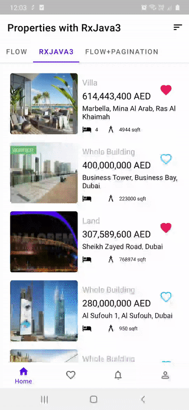
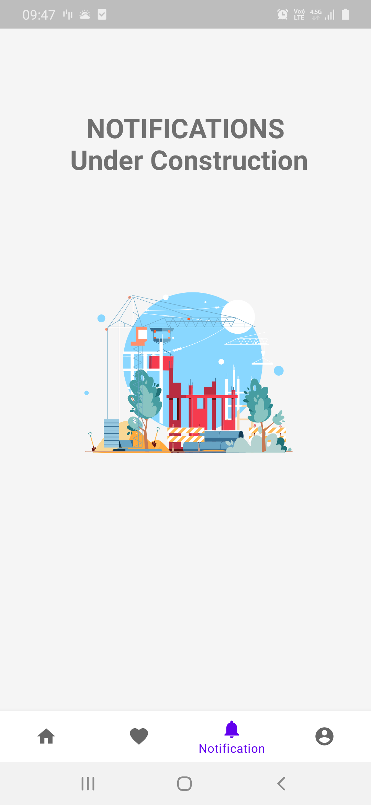
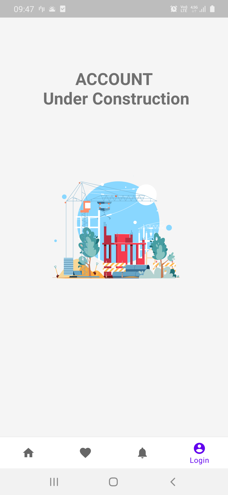

# 🏘  Real Estate App with MVVM Clean Architecture RxJava3+Coroutines Flow, Static Code Analysis, Dagger Hilt, Dynamic Features

[](https://ktlint.github.io/)
[](https://kotlinlang.org)
[](https://android-arsenal.com/api?level=21)


## About

Sample project that build with MVVM clean architecture and various cool techs including RxJava3 and Coroutines Flow, Dynamic Feature modules as base of BottomNavigationView or ViewPager2, with both OfflineFirst and OfflineLast approaches as database Single Source of Truth Merge Adapter, ViewBinders for setting inner RecyclerViews, RecycledViewPools, SavedStateHandle, and more.

Unit tests are written with JUnit4, JUnit5, MockK, Truth, MockWebServer. Data(including for both RxJava and Coroutines tests for Room and Retrofit), Domain, and ViewModel tests in Home module are written with Test Driven Development.

| Flow      | RxJava3   | Pagination |
| ----------|-----------| -----------|
|  |  |  |

| Dashboard | Notification   | Account |
| ----------|----------------| --------|
|  |  |  |


## 🤓 Overview
* Gradle Kotlin DSL is used for setting up gradle files with ```buildSrc``` folder and extensions.
* KtLint, Detekt, and Git Hooks is used for checking, and formatting code and validating code before commits.
* Dagger Hilt, Dynamic Feature Modules with Navigation Components, ViewModel, Retrofit, Room, RxJava, Coroutines libraries and dependencies are set up.
* ```features``` and ```libraries``` folders are used to include android libraries and dynamic feature modules
* In core module dagger hilt dependencies and ```@EntryPoint``` is created
* Data module uses Retrofit and Room to provide Local and Remote data sources
* Room database has many-to-many and one-to many relation with Junction/Association table.
* Repository provides offline and remote sources and mappers, local save, delete and fetch functions
* Domain module uses useCase classes to implement business logic to fetch and forward data
* ViewModel uses LiveData with data-binding to display LOADING, and ERROR or SUCCESS states.
* Home dynamic feature module has a ViewPager2 that hosts property lists
* Dashboard module contains list with different type of layouts using **ViewBinder** classes, and Recommendations based on users history and **ConcatAdapter** to
merge different type of Adapters.


## Built With 🛠

Some of the popular libraries and MVVM clean architecture used with offline-first and offline-last with Room database and Retrofit as data source

* [Kotlin](https://kotlinlang.org/) - First class and official programming language for Android development.

* [Coroutines](https://kotlinlang.org/docs/reference/coroutines-overview.html) - Threads on steroids for Kotlin
* [Flow](https://kotlin.github.io/kotlinx.coroutines/kotlinx-coroutines-core/kotlinx.coroutines.flow/-flow/) - A cold asynchronous data stream that sequentially emits values and completes normally or with an exception.
* [RxJava3](https://github.com/ReactiveX/RxJava) - Newest version of famous reactive programming library for Java, and other languages
* [Android JetPack](https://developer.android.com/jetpack) - Collection of libraries that help you design robust, testable, and maintainable apps.
  * [LiveData](https://developer.android.com/topic/libraries/architecture/livedata) - Data objects that notify views when the underlying database changes.
  * [ViewModel](https://developer.android.com/topic/libraries/architecture/viewmodel) - Stores UI-related data that isn't destroyed on UI changes.
  * [DataBinding](https://developer.android.com/topic/libraries/data-binding) - Generates a binding class for each XML layout file present in that module and allows you to more easily write code that interacts with views.
  * [Navigation Components](https://developer.android.com/guide/navigation/navigation-getting-started) Navigate fragments as never easier before
  * [Dynamic Feature Modules](https://developer.android.com/guide/playcore/dynamic-delivery) Dynamic modules for adding or removing based on preference
  * [SavedStateHandle](https://developer.android.com/reference/androidx/lifecycle/SavedStateHandle) A handle to saved state passed down to androidx.lifecycle.ViewModel. You should use SavedStateViewModelFactory if you want to receive this object in ViewModel's constructor.
  * [Room](https://developer.android.google.cn/jetpack/androidx/releases/room) Persistence library provides an abstraction layer over SQLite to allow for more robust database access while harnessing the full power of SQLite.
* [Material Components for Android](https://github.com/material-components/material-components-android) - Modular and customizable Material Design UI components for Android.
* [Dependency Injection](https://developer.android.com/training/dependency-injection) -
  * [Hilt-Dagger](https://dagger.dev/hilt/) - Standard library to incorporate Dagger dependency injection into an Android application.
  * [Hilt-ViewModel](https://developer.android.com/training/dependency-injection/hilt-jetpack) - DI for injecting `ViewModel`.
* [Retrofit](https://square.github.io/retrofit/) - A type-safe HTTP client for Android and Java.
* [Glide](https://github.com/bumptech/glide) - Image loading library.
* [ConcatAdapter](https://medium.com/androiddevelopers/merge-adapters-sequentially-with-mergeadapter-294d2942127a) RecyclerView adapter which enables you to sequentially combine multiple adapters to be displayed in a single RecyclerView.
* [Lottie](http://airbnb.io/lottie) - Animation library from AirBnB
* [MpChart](https://github.com/PhilJay/MPAndroidChart) - ⚡️ MPAndroidChart is a powerful & easy to use chart library for Android ⚡️
* [Chucker](https://github.com/ChuckerTeam/chucker) - OkHttp interceptor providing a UI for inspecting and sharing their content.

* Architecture
    * Clean Architecture
    * MVVM + MVI
    * Offline first/last with Room an Retrofit
    * [Dynamic feature modules](https://developer.android.com/studio/projects/dynamic-delivery)
* Tests
    * [Unit Tests](https://en.wikipedia.org/wiki/Unit_testing) ([JUnit5](https://junit.org/junit5/)) ([JUnit4](https://junit.org/junit4/))
    * [MockWebServer](https://github.com/square/okhttp/tree/master/mockwebserver) Mock server for testing Api requests with OkHttp and Retrofit
    * [Mockk](https://mockk.io/) Mockking library for Kotlin
    * [Truth](https://truth.dev) Assertion library
    * [FlowTestObserver](https://github.com/SmartToolFactory/RxJava-Style-LiveData-And-Flow-TestObserver) RxJava style test observer for testing Flow
    * [LiveDataTestObserve](https://github.com/SmartToolFactory/RxJava-Style-LiveData-And-Flow-TestObserver) RxJava style test observer for LiveData
* Gradle
    * [Gradle Kotlin DSL](https://docs.gradle.org/current/userguide/kotlin_dsl.html)
    * Custom tasks
    * Plugins ([Ktlint](https://github.com/JLLeitschuh/ktlint-gradle), [Detekt](https://github.com/arturbosch/detekt#with-gradle), [SafeArgs](https://developer.android.com/guide/navigation/navigation-pass-data#Safe-args)), [Git Hooks](https://githooks.com)


### Modularaization, Library and Feature Modules

Uses both library modules and dynamic feature modules

## Architecture


Uses concepts of clean architecture

## Data Module

## Domain Module

### Database and Table Relations with Junction Table
